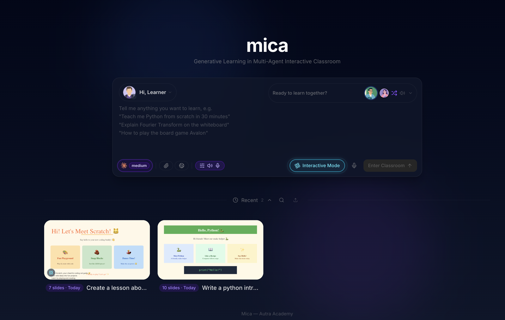

# mica — Instructor Onboarding Guide

**AI-Powered Lesson Creation for Autra Academy** · May 2026 · [mica.dev.autra.ai](https://mica.dev.autra.ai)

---

## What is Mica?

Mica assists at every stage of lesson creation. Feed it a detailed prompt, a document, or raw notes — it generates a complete set of slides tailored to your content. Review the outline first, then fine-tune anything before you're done.

This guide covers both the **manual slide editor** (drag, type, format) and the **AI edit command** (describe what you want and let Mica apply it).



---

## Getting started — login

### 1. Connect to Twingate VPN

Mica is only accessible on the Autra internal network. Open the **Twingate** app and make sure it shows *Connected* before opening your browser.

> **No Twingate?** Ask your admin to add you to the Autra network. The app is available at **twingate.com/download**.

### 2. Open Mica

Navigate to `mica.dev.autra.ai` in your browser. You'll see a lock screen asking for an access code.

### 3. Enter the access code

Type the access code and press Enter (or click the arrow button):

**`Autra2026`**

The code is stored in your browser — you only need to enter it once per device.

> **Tip:** Bookmark `mica.dev.autra.ai` now. Twingate must be on every time you visit, but the access code is remembered.

---

## Step 1 — Write a good prompt

The quality of your lesson depends on how clearly you describe it. Include:

- **Topic** — what the lesson is about
- **Audience** — grade level or prior knowledge
- **Duration** — how long the class runs
- **Specific content** — key concepts to cover, examples to include, things to avoid

> *"Wiring an ultrasonic sensor to an Arduino, grade 6, 30 minutes. Cover: how ultrasonic distance measurement works, reading the sensor with digitalRead, a simple obstacle-detection sketch. Avoid: analog sensors, serial plotter."*

> **Tip:** You can paste in reference material directly — a curriculum outline, PDF excerpt, or bullet points. Mica will use it as source content.

---

## Step 2 — Turn on Interactive Mode

Before generating, toggle **Interactive Mode** on (the button in the top bar).

With Interactive Mode on, Mica biases the lesson toward active content: 3D visualizations, simulations, in-browser coding exercises, and mind maps — rather than passive slides. For robotics topics this makes a noticeable difference.

> **Note:** The toggle affects the *next* generation. Set it before you submit your prompt.

---

## Step 3 — Review and edit the outline

After submitting your prompt, Mica streams an **outline** — a structured lesson plan, one entry per scene. This is your chance to shape the lesson before anything is fully generated.

- Reorder scenes by dragging them
- Edit scene titles and descriptions to match your language
- Delete scenes you don't need
- Add a scene if something important is missing

> **Tip:** Take 2–3 minutes here. The outline is much faster to edit than the finished slides. When you're happy, click **Generate**.

---

## Step 4 — Wait for generation (~3–5 min)

Mica generates each scene in parallel — you'll see them appear one by one. Each scene includes slide content, an AI narration script, and quiz questions where applicable.

You don't need to wait for all scenes. Start reviewing the first ones while the rest are still generating.

---

## Step 5 — Manually edit your slides

Click any slide scene in the left sidebar to open it. To switch into edit mode, click the **✏ pen icon** in the bottom toolbar. The slide canvas becomes editable — a second toolbar appears across the top with all your editing tools.

```
↩ Undo  ↪ Redo  |  T Text  ◇ Shape  — Line  → Arrow  |  🖼 Image  ⊞ Table  |  🎨 Background  |  ✦ AI
```

When you are done editing, click the **👁 eye icon** in the bottom toolbar to return to playback mode.

### Selecting and moving elements

Click any element on the slide to select it. A selection box with handles appears around it.

| Action | How |
|--------|-----|
| Move an element | Click and drag it to a new position |
| Resize | Drag any corner or edge handle |
| Rotate | Drag the rotation handle (circle above the selection box) |
| Select multiple | Hold `Shift` and click each element |
| Delete selected | Press `Delete` or `Backspace` |
| Undo a change | `Ctrl+Z` (or the Undo button in the toolbar) |
| Redo | `Ctrl+Shift+Z` (or the Redo button) |

### Editing text

Click a text element to select it, then **click again (or double-click)** to enter text-editing mode. A formatting bar appears below the main toolbar.

| Control | What it does |
|---------|-------------|
| **B / I / U / S** | Bold, italic, underline, strikethrough |
| **Font ▾** | Change the typeface (Inter, Roboto, Playfair Display, and more) |
| **A− / number / A+** | Decrease, set, or increase font size. Type a number directly into the box. |
| **A (underlined)** | Text color — click to open the color picker |
| **HL** | Highlight / background color for selected text |
| **≡L / ≡C / ≡R** | Align text left, center, or right |
| **• List / 1. List** | Toggle bullet list or numbered list |

Click outside the text element (or press `Escape`) to finish editing.

### Editing table cells

Tables support inline cell editing. Click the table to select it, then **double-click any cell** to edit its text.

- Press `Enter` to save and exit the cell
- Press `Shift+Enter` for a line break within the cell
- Press `Escape` or click outside to discard and exit

### Adding new elements

| Tool | How to use |
|------|-----------|
| **T Text** | Click the button, then draw a rectangle on the slide where you want the text box to appear |
| **◇ Shape** | Click to open the shape library, pick a shape, then draw it on the slide |
| **— Line / → Arrow** | Click the button, then draw by clicking the start point and dragging to the end |
| **🖼 Image** | Click to open a file picker — JPG, PNG, GIF, and SVG are supported |
| **⊞ Table** | Click to open a grid picker, hover to choose rows × columns, then click to insert |

### Changing the slide background

Click **🎨 Background** in the toolbar. A popover opens with three options:

- **Color** — pick a solid fill color
- **Gradient** — choose two colors and a direction (left-to-right, diagonal, etc.)
- **Image** — upload a background image; choose Cover, Contain, or Tile for sizing

Changes apply immediately and can be undone with `Ctrl+Z`.

### Properties panel (right side)

When an element is selected, a **Properties** panel appears on the right side of the canvas:

- **Position** — X and Y coordinates from the top-left corner of the slide (in pixels)
- **Size** — Width and Height in pixels
- **Rotation** — degrees (0 = upright)
- **Style** — fill color, opacity, outline style, and other type-specific options

### Right-click menu

Right-click any element in edit mode for additional actions: Cut, Copy, Paste, Align to slide, Send to back / Bring to front, Group / Ungroup, Lock, and Delete.

> **Locked elements** cannot be moved or edited until you right-click them and choose **Unlock**. Lock elements you've finalized to avoid accidentally moving them while editing others.

---

## Step 6 — Edit slides with AI

The **✦ AI** button at the right end of the edit toolbar lets you describe a change in plain language — Mica applies it to the current slide instantly.

> **How it works:** Mica reads the current slide's elements (their IDs, positions, and text), sends them to the AI along with your instruction, and receives a list of precise operations to run — add, update, or delete elements. The change lands on the slide in seconds.

### How to use it

1. Enter edit mode (click the ✏ pen icon)
2. Click the **✦ AI** button — a prompt box opens with two tabs: **Edit** and **Image**
3. In the **Edit** tab: type your instruction or click a hint chip to pre-fill it, then press `Enter`
4. In the **Image** tab: describe an image you want inserted, then click **Generate** — it drops into the slide automatically
5. Review the result; press `Ctrl+Z` to undo if needed

> **Tip:** Every AI-generated change is fully undoable. Don't hesitate to try something — you can always undo it.

### What to ask for

**Adding content**
- *"Add a slide title at the top that says 'Introduction to Ultrasonic Sensors'"*
- *"Add a text box in the bottom-left corner with a fun fact about sound waves"*
- *"Add three bullet points below the heading summarizing the key concepts"*

**Updating existing text**
- *"Change the heading to 'How Ultrasonic Distance Works'"*
- *"Rewrite the paragraph to be simpler — grade 5 reading level"*
- *"Make the subtitle more engaging and action-oriented"*

**Removing clutter**
- *"Remove the image placeholder at the bottom"*
- *"Delete the caption text under the diagram"*

**Restructuring and style**
- *"Split the long paragraph into two shorter ones and move them side by side"*
- *"Replace the paragraph with a 4-item bullet list covering the same points"*
- *"Change the title font to Playfair Display and make it larger"*
- *"Change the background to a dark navy blue"*

**Text operations (hint chips)**

Six shortcut chips sit below the text box in the Edit tab. Click any chip to run it immediately:

- **Polish all text** — fixes grammar and improves clarity across the slide
- **Compress to bullets** — rewrites paragraphs as concise bullet lists
- **Expand text** — adds more detail and depth to short content
- **Rearrange in a clean layout** — repositions all elements for better visual balance
- **Make title larger** — increases the title element's font size
- **Change background color** — prompts the AI to pick and apply a new background

### What AI editing cannot do (yet)

The AI edit command can add, update, or remove text elements, rearrange layouts, change colors and fonts, and generate images. It cannot:

- Edit individual table cell styles (bold, color per cell)
- Change shapes, lines, or animations

For those, use the manual tools in Step 5.

> **Best practice:** Use AI for broad changes — rewriting content, restructuring layout, changing colors or fonts across the slide. Switch to the manual toolbar for precise, element-by-element tweaks like pixel-perfect sizing or per-character formatting.

---

## Step 7 — Presenter notes

A **Notes** bar sits below the slide canvas in edit mode. Click it to expand a text area where you can write or generate speaker notes for each slide.

- Type notes manually — they save automatically as you type
- Click **✦ Generate** to have AI write talking points from the current slide content
- Notes are per-slide — each slide keeps its own notes independently

> **Tip:** Generated notes focus on what to *say*, not what's already visible on the slide — transitions, emphasis, and points students commonly ask about.

---

## Step 8 — Save your lesson

Mica saves your lesson in your browser automatically. Export it to keep a permanent copy or share it.

**Classroom ZIP — recommended for saving**
Click **Export → Download Classroom (.maic.zip)**. Saves everything: scenes, audio, media, and whiteboard state. Re-import it on any Mica instance: home page → **Import** → drop the ZIP.

**PowerPoint — for sharing or printing**
Click **Export → Download PPTX**. Opens in PowerPoint. Good for sharing with colleagues or printing handouts.

---

## Step 9 — Use it in class

1. Open your lesson in Mica on the classroom computer (Twingate on)
2. Press `F11` to go fullscreen — the sidebar and chat hide automatically
3. Control playback with the keyboard:

| Key | Action |
|-----|--------|
| `Space` | Play / pause |
| `→` `←` | Next / previous scene |
| `M` | Mute AI narration — you speak instead |
| `↑` `↓` | Volume up / down |
| `Esc` | Exit fullscreen |

### Two in-class modes

| Mode | How to use |
|------|-----------|
| **AI-led** | Press play — AI narrates and auto-advances. Interrupt with `Space` anytime, then resume. Good for your first run. |
| **Instructor-led** | Press `M` to mute, drive manually with arrow keys. Works like PowerPoint with Mica's interactive widgets. |

---

## Quick reference — edit mode shortcuts

| Shortcut | Action |
|----------|--------|
| `Ctrl+Z` | Undo |
| `Ctrl+Shift+Z` | Redo |
| `Ctrl+C` | Copy selected element |
| `Ctrl+X` | Cut selected element |
| `Ctrl+V` | Paste |
| `Delete` | Delete selected element |
| `Ctrl+A` | Select all elements |
| `Ctrl+G` | Group / ungroup selected elements |
| `Ctrl+L` | Lock / unlock selected element |
| `Escape` | Deselect / exit text editing |

---

## Tips from early instructors

- **Spend time on the prompt.** Two extra minutes writing a detailed prompt saves ten minutes of slide editing.
- **Edit the outline, not the slides.** Faster to fix a scene description before generation than after.
- **Use AI for broad changes, the toolbar for fine-tuning.** Ask AI to rewrite content, change fonts, or restructure the layout — then use the formatting bar to dial in exact sizes and colors.
- **Every AI change is undoable.** Don't be afraid to try an AI edit — if you don't like it, `Ctrl+Z` brings you right back.
- **Interactive Mode is worth it for robotics.** 3D circuit simulators and in-browser code editors make hands-on topics come alive.
- **Export a ZIP before class.** If the classroom laptop loses internet mid-class, you still have the full lesson locally.
- **Mute + arrow keys = PowerPoint mode.** If a lesson isn't quite right, fall back to instructor-led delivery without re-generating anything.

---

## Add your own voice *(Advanced)*

Instead of the default AI voice, use a voice clone that sounds like you. Takes ~10 minutes to set up once.

### ElevenLabs — voice cloning (recommended)

1. Create a free account at **elevenlabs.io**
2. Go to **Voices → Add Voice → Instant Voice Clone**
3. Upload 1–3 minutes of clean audio of yourself speaking (a phone recording works)
4. ElevenLabs creates your voice clone and gives it a **Voice ID**
5. Get your **API key** from elevenlabs.io → Profile → API Key
6. In Mica: **Settings → Audio → Text-to-Speech → ElevenLabs**
7. Enter your API key and Voice ID → click **Test**

All newly generated lessons will use your cloned voice from that point on.

### OpenAI TTS — simpler, no cloning

Settings → Audio → Text-to-Speech → OpenAI → choose from: `alloy`, `echo`, `fable`, `onyx`, `nova`, or `shimmer`.

---

*Questions? Contact your Autra Academy admin or bring them to the weekly instructor feedback session.*
*mica.dev.autra.ai · Autra Academy · May 2026*
